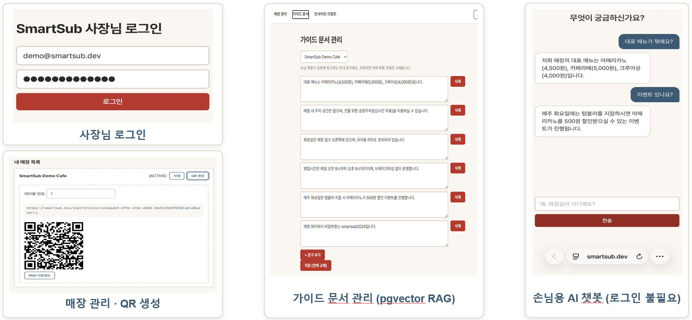
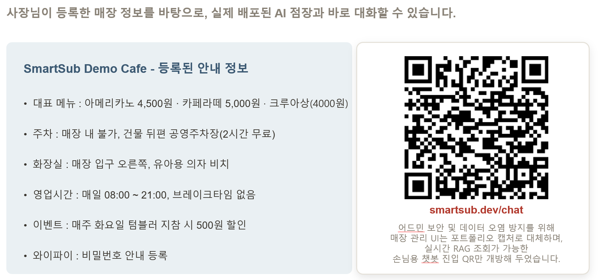
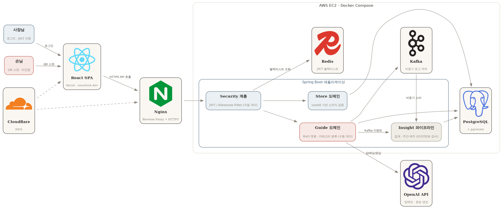

# SmartSub V2

> 중소규모 자영업자를 위한 멀티테넌시 RAG 기반 AI QR 가이드 B2B SaaS 플랫폼

## 프로젝트 개요

매장에 배치된 QR 코드를 손님이 스캔하면, 사장님이 등록한 매장 맞춤형 데이터를 학습한 AI 챗봇이 생성되어 손님의 질문에 다국어로 실시간 응대합니다.

- **반복 응대 리소스 절감** — 주차, 와이파이, 화장실 등 하루 수십 번 발생하는 단순 질문을 AI가 처리
- **다국어 소통** — 외국어 응대 인력 없이 한/영/일/중 자동 응답
- **손님 질문 패턴 기반 인사이트** — 손님 질문을 카테고리별로 자동 분류·집계해, 사장님에게 주간 리포트로 제공

## 라이브 데모

- **서비스**: [smartsub.dev](https://smartsub.dev) — 사장님용 관리자 페이지(로그인 필요). 회원가입 기능은 구현되어 있으나, 실사용 데이터 보호를 위해 접근을 제한해두었습니다.
- **손님용 체험**: [smartsub.dev/chat](https://smartsub.dev/chat) — 로그인 없이 QR 스캔부터 AI 응대까지 바로 체험 가능(아래 QR 스캔 데모 이미지 참고)
- **배포 환경**: AWS EC2(Docker Compose) 위에 Nginx 리버스 프록시 + Let's Encrypt(Certbot) HTTPS + Cloudflare DNS로 구성해 실서비스 형태로 운영 중
- 실제 아이폰·갤럭시로 QR 스캔부터 챗봇 응답까지 실기기 End-to-End 검증 완료



지금 바로 스캔해보실 수 있습니다:



## 기술 스택

| 분류        | 기술                                                               |
| --------- | ---------------------------------------------------------------- |
| Language  | Java 17                                                          |
| Framework | Spring Boot 3.4.5                                                |
| ORM       | Spring Data JPA, Hibernate                                       |
| Security  | Spring Security, JWT (jjwt 0.12.6)                               |
| AI        | Spring AI 1.0.0-M6, OpenAI (text-embedding-3-small, gpt-4o-mini) |
| Database  | PostgreSQL 16, pgvector                                          |
| Messaging | Apache Kafka                                                     |
| Cache     | Redis                                                            |
| Frontend  | React                                                             |
| Test      | JUnit5, Mockito, MockMvc                                         |
| CI/CD     | GitHub Actions                                                   |
| Build     | Gradle                                                           |
| Infra     | Docker, AWS EC2, Nginx, Let's Encrypt, Cloudflare                |

## 핵심 아키텍처



### ① 공유 테이블 기반 멀티테넌시

B2B SaaS 특성상 수백 개 매장이 단일 DB를 공유합니다. 매장별로 독립 DB를 구성하면 인프라 비용과 커넥션 풀 관리가 비효율적이므로, 공유 테이블 + 인프라 레이어 자동 격리 방식을 채택했습니다.

HTTP 요청
→ TenantInterceptor: JWT에서 storeId 추출
→ ThreadLocal: 요청 스코프에 storeId 저장
→ TenantFilterAspect: Hibernate Filter 자동 활성화
→ SELECT * FROM p_products WHERE store_id = 'aaa' (자동 조건 추가)

### ② 테넌트 격리형 RAG

사장님이 등록한 가이드라인 텍스트를 임베딩하여 pgvector에 저장할 때 storeId를 메타데이터로 강제 바인딩합니다. 손님 질문 시 해당 매장 경계 안에서만 코사인 유사도 검색이 동작합니다.

손님 질문
→ 질문 임베딩 (text-embedding-3-small)
→ 코사인 유사도 검색 (WHERE store_id = :storeId)
→ Top-K 유사 문서 추출
→ LLM 응답 생성 (gpt-4o-mini)
→ 다국어 응답 반환

### ②-a RAG 검색 품질 고도화 — HyDE

질문을 그대로 임베딩하는 대신, LLM으로 "이 질문에 대한 가상의 답변"을 먼저 생성해 그 답변을 임베딩·검색에 사용하는 HyDE(Hypothetical Document Embeddings)를 적용했습니다. 손님 질문(의문문·구어체)과 등록 문서(평서문·안내문 톤)의 표현 형식 차이로 인한 유사도 저하를 줄이기 위함입니다.

손님 질문
→ HydeQueryExpander: LLM으로 가상 답변 생성 (검색에만 사용, 손님에게 미노출)
→ 가상 답변 임베딩
→ 코사인 유사도 검색

자체 평가셋(질문 7건) 기준, 적용 전/후 pgvector 코사인 거리를 직접 측정한 결과 평균 24% 감소(0.585 → 0.444)했습니다. 다만 7건 중 1건은 질문 자체가 이미 키워드로 명확한 경우라 오히려 거리가 늘어난 것도 함께 확인했습니다.

### ③ JWT 기반 인증/인가

로그인
→ userId로 매장 조회 → storeId 획득
→ JWT 발급 (userId, email, role, storeId 포함)
→ 이후 요청에서 토큰만으로 테넌트 자동 식별

### ④ Kafka 기반 비동기 채팅 로그 적재

손님-챗봇 대화 로그는 서비스 응답과 직접적인 관련이 없는 부가 기능(책임 분리, SoC)이므로, 동기 저장에서 Kafka 비동기 처리로 전환했습니다.

ChatService (질문 처리)
→ ChatLogProducer: 토픽에 이벤트 발행
→ ChatLogConsumer: 별도 컨슈머가 비동기로 DB 저장

이를 통해 챗봇 응답 로직과 로그 적재 로직의 책임을 분리했습니다. (자세한 내용은 트러블슈팅 참고)

### ⑤ Redis 기반 JWT 블랙리스트

JWT는 발급 후 서버가 강제로 무효화할 수 없다는 구조적 한계가 있습니다. 로그아웃 시 해당 토큰을 Redis에 등록하여, 만료 전까지 재사용을 차단합니다.

로그아웃 요청
→ 토큰의 남은 만료 시간 계산
→ Redis에 토큰 등록 (TTL = 남은 만료 시간)
→ 이후 요청마다 JwtAuthenticationFilter가 블랙리스트 여부 확인

## 패키지 구조

```
com.smartsub
├── global
│   ├── common          — BaseEntity (Soft Delete, JPA Auditing)
│   ├── config          — Security, JPA, ChatClient 설정
│   ├── exception       — 글로벌 예외 처리 (BusinessException, ErrorCode)
│   ├── jwt             — JwtTokenProvider, JwtAuthenticationFilter, TokenBlacklistRepository
│   └── tenant          — TenantContext, TenantInterceptor, TenantFilterAspect
├── user
│   ├── domain          — User, UserRole, UserStatus
│   ├── application     — AuthService
│   ├── infrastructure  — UserJpaRepository
│   └── presentation    — AuthController
├── store
│   ├── domain          — Store, StoreStatus
│   ├── application     — StoreService
│   ├── infrastructure  — StoreJpaRepository
│   └── presentation    — StoreController
├── product
│   ├── domain          — Product, ProductStatus, ProductUnit
│   ├── application     — ProductService
│   ├── infrastructure  — ProductJpaRepository
│   └── presentation    — ProductController
└── guide
    ├── domain          — GuideDocument, ChatLog, GuideDocumentProjection, Language
    ├── application     — EmbeddingService, ChatService, HydeQueryExpander
    ├── infrastructure  — GuideDocumentJpaRepository, ChatLogProducer, ChatLogConsumer
    └── presentation    — GuideController

```

## API 명세

### 인증

| Method | URI                  | 설명                 | 인증  |
| ------ | -------------------- | ------------------ | --- |
| POST   | /api/v1/auth/signup  | 회원가입               | 불필요 |
| POST   | /api/v1/auth/signin  | 로그인 (JWT 발급)       | 불필요 |
| POST   | /api/v1/auth/signout | 로그아웃 (토큰 블랙리스트 등록) | JWT |

### 매장

| Method | URI                      | 설명       | 인증  |
| ------ | ------------------------ | -------- | --- |
| POST   | /api/v1/stores           | 매장 등록    | JWT |
| GET    | /api/v1/stores           | 매장 목록 조회 | JWT |
| GET    | /api/v1/stores/{storeId} | 매장 단건 조회 | JWT |
| PATCH  | /api/v1/stores/{storeId} | 매장 수정    | JWT |
| DELETE | /api/v1/stores/{storeId} | 매장 삭제    | JWT |

### 상품

| Method | URI                          | 설명       | 인증  |
| ------ | ---------------------------- | -------- | --- |
| POST   | /api/v1/products             | 상품 등록    | JWT |
| GET    | /api/v1/products             | 상품 목록 조회 | JWT |
| GET    | /api/v1/products/{productId} | 상품 단건 조회 | JWT |
| PATCH  | /api/v1/products/{productId} | 상품 수정    | JWT |
| DELETE | /api/v1/products/{productId} | 상품 삭제    | JWT |

### AI 가이드

| Method | URI                 | 설명               | 인증  |
| ------ | ------------------- | ---------------- | --- |
| POST   | /api/v1/guide/embed | 가이드라인 텍스트 임베딩 등록 | JWT |
| POST   | /api/v1/guide/chat  | 손님 QR 챗봇 질문      | 불필요 |

## 실사용 검증 — 발견한 보안 결함 3건

API 단위 테스트와 코드 리뷰만으로는 드러나지 않았던 문제들이, 프론트엔드를 붙이고 실제로 여러 계정을 번갈아 사용해보는 과정에서 발견됐습니다.

| # | 결함 | 원인 | 해결 |
|---|---|---|---|
| 1 | 매장 소유자 검증 누락 | `Store`는 Hibernate `@Filter`의 storeId 기반 자동 격리 대상이 아닌데(격리 기준이 userId), 서비스 레이어의 수동 검증이 빠져 있어 타 매장 조회·수정·삭제가 가능했음 | 존재 확인 + 소유자 검증을 하나로 묶은 `getOwnedStore()` 도입, 타 매장 접근 시 404로 통일 |
| 2 | QR 노출 정보 기반 비인증 문서 조작 취약점 | `/guide/**` 전체가 `permitAll()`이라 손님용(`/chat`)뿐 아니라 사장님 전용 등록 API(`/embed`)도 비인증 접근 가능 — QR에 storeId가 URL로 공개되는 설계와 맞물려 위험도가 큼 | `/chat`만 공개 유지, `/embed`·`/documents`는 인증 + 소유자 검증 추가 |
| 3 | 1인 다매장 로그인 정합성 오류 | JWT의 storeId 클레임 설계가 "1인 1매장"을 전제하는데, 매장 생성 시 이를 강제하는 검증이 없어 매장 2개 보유 계정에서 로그인 예외 발생 | 매장 생성 시 1인 1매장 정책을 서비스 레이어에서 강제 (1인 다매장 지원은 구현 예정) |

## 테스트

핵심 비즈니스 로직, 도메인 엔티티, 멀티테넌시 격리, API 엔드포인트를 자동화된 테스트로 검증합니다.

| 구분     | 대상                                                                  | 검증 내용                                    |
| ------ | ------------------------------------------------------------------- | ---------------------------------------- |
| 단위 테스트 | AuthService, ChatService, EmbeddingService, HydeQueryExpander        | 정상/예외 케이스, Mock 기반 의존성 격리                |
| 단위 테스트 | User, Store, Product, ChatLog, GuideDocument, BaseEntity            | 정적 팩토리 메서드, Soft Delete 동작               |
| 통합 테스트 | 멀티테넌시 격리 (Product, GuideDocument)                                   | 타 매장 데이터 비조회, 자기 매장 데이터 정상 조회            |
| 통합 테스트 | AuthController, GuideController, ProductController, StoreController | MockMvc 기반 HTTP 요청-응답, 인증/인가, validation |
| 평가 스크립트 | HydeRetrievalComparisonTest                                          | HyDE 적용 전/후 검색 품질(pgvector 거리) 비교        |

테스트 환경은 운영 DB와 분리된 전용 PostgreSQL(`smartsub_test`)을 사용하며, `ddl-auto: create-drop`으로 매 테스트마다 깨끗한 스키마를 보장합니다.

## CI

GitHub Actions를 통해 PR 생성 및 `dev`/`main` 브랜치 push 시 전체 테스트 스위트가 자동으로 실행됩니다.

PR 생성 / Push
→ PostgreSQL(pgvector), Redis, Kafka를 GitHub Actions services로 기동
→ pgvector 확장 활성화
→ ./gradlew test 실행
→ 실패 시 테스트 리포트 아티팩트 업로드

## 트러블슈팅

### Hibernate `float[]` → `bytea` 직렬화 문제

**문제** pgvector `vector` 타입 컬럼에 저장 시 Hibernate가 `float[]`을 `bytea`로 직렬화하여 타입 불일치 발생

**해결** JPA 엔티티 매핑 대신 네이티브 INSERT 쿼리 + `CAST(:embedding AS vector)` 적용, 조회 시 인터페이스 프로젝션으로 역직렬화 문제 우회

### TenantInterceptor 에러 응답 누락

**문제** 인증 토큰 누락 시 응답 바디가 비어있음

**해결** `@RestControllerAdvice`는 컨트롤러 이후에만 동작하므로, 인터셉터에서 직접 JSON 응답을 작성

### AuditorAware NOT NULL 제약 위반

**문제** 인증 없는 회원가입 요청에서 `created_by` 컬럼 `null` 저장 시 제약 위반

**해결** `BaseEntity`의 `createdBy`, `updatedBy` 컬럼 `nullable = false` 제거

### Spring AI 의존성 해결 실패

**문제** Spring Boot `3.5.x`에서 Spring AI 아티팩트를 찾지 못함

**해결** Spring Boot `3.4.5`로 다운그레이드, Spring Milestone 저장소 추가, BOM 버전 `1.0.0-M6` 적용

### Kafka 전환 시 응답 속도 개선 효과 불명확

**문제** 채팅 로그를 동기 저장에서 Kafka 비동기 전환 후 k6 부하 테스트 결과, 응답 속도가 오히려 소폭 저하됨 (OpenAI API 호출 자체의 변동성이 전체 응답 시간을 지배적으로 좌우)

**해결** Kafka 도입의 본질을 "응답 속도 개선"이 아닌 "책임 분리(SoC)"로 재정의. 챗봇 응답 로직과 로그 적재 로직을 분리함으로써, 로그 저장 방식이 바뀌거나 장애가 발생해도 손님 응대에 영향이 없도록 설계 목표를 명확히 함

### Redis 도입 배경 — JWT 무효화 취약점

**문제** Stateless JWT는 발급 후 서버가 강제로 만료시킬 수 없어, 로그아웃해도 탈취된 토큰이 만료 전까지 계속 유효한 보안 취약점 존재

**해결** Redis에 로그아웃된 토큰을 등록하는 블랙리스트 방식 도입. 토큰의 남은 만료 시간만큼 TTL을 설정해 Redis 메모리가 불필요하게 누적되지 않도록 처리

### TestContainers ↔ Docker Desktop API 버전 호환성 문제

**문제** 멀티테넌시 격리 통합 테스트 작성 시 TestContainers를 도입했으나, 로컬 Docker Desktop(Engine API 1.54)과 TestContainers/docker-java 클라이언트 간 호환성 문제로 `BadRequestException`(빈 응답) 발생. Docker Desktop 버전 업그레이드, TestContainers 버전 상향, `DOCKER_HOST`/`DOCKER_API_VERSION` 환경변수 조정 등 다양한 시도에도 동일 문제 재현

**해결** TestContainers 도입을 보류하고, 로컬 PostgreSQL 컨테이너 내 테스트 전용 DB(`smartsub_test`)를 분리하여 운영 DB와 격리. CI(GitHub Actions)에서는 `services` 블록으로 PostgreSQL/Redis/Kafka를 직접 기동하여 동일한 문제를 원천적으로 회피

### 배포 환경에서 pgvector 테이블 미생성

**문제** EC2 신규 환경 배포 시 다른 테이블은 다 자동 생성됐는데 `p_guide_documents`만 없음 — Hibernate 자동 DDL이 `vector` 타입 컬럼을 인식하지 못해 테이블 생성을 건너뜀

**해결** `docker-entrypoint-initdb.d`의 `init.sql`로 pgvector 확장 활성화와 테이블 생성을 명시적으로 처리

### 환경변수 우선순위 충돌 (OpenAI 401)

**문제** `.env` 키 값이 맞는데도 OpenAI 401 지속 — 원인이 두 겹: `.env`에 Windows 줄바꿈(`\r`)이 섞여 키가 손상됐고, Windows 시스템 환경변수가 `.env`보다 우선 적용되고 있었음

**해결** 서버(리눅스)에서 `.env` 재작성, Windows 환경변수 정리

### HTTPS 미설정으로 인한 연결 거부

**문제** Nginx가 443 포트를 듣고 있지 않아 프론트엔드 HTTPS 요청이 `ERR_CONNECTION_REFUSED`

**해결** Certbot(`--nginx` 플러그인)으로 인증서 발급과 Nginx 설정 반영을 자동화. 이후 EC2 보안 그룹의 80/443 외부 개방까지 확인해 실기기 검증 완료

## 로컬 실행 방법

### 1. PostgreSQL + pgvector 실행

```
docker run -d --name smartsub-postgres -e POSTGRES_DB=smartsub -e POSTGRES_USER=smartsub -e POSTGRES_PASSWORD=smartsub1234 -p 5432:5432 pgvector/pgvector:pg16
```

### 2. pgvector 확장 활성화

```
docker exec -it smartsub-postgres psql -U smartsub -d smartsub -c "CREATE EXTENSION IF NOT EXISTS vector;"
```

### 3. Kafka 실행

```
docker run -d --name smartsub-kafka -p 9092:9092 apache/kafka:3.7.0
```

### 4. Redis 실행

```
docker run -d --name smartsub-redis -p 6379:6379 redis:7-alpine
```

### 5. 애플리케이션 실행

```
./gradlew bootRun
```

## 향후 구현 예정

- [ ] RAG 검색 고도화 — Re-ranking 도입, 질문 명확도에 따라 HyDE 선택적 적용
- [ ] LLMOps — 응답 지연시간(latency)·토큰 사용량 모니터링, 프롬프트 버전 관리
- [ ] Spring Batch로 배치 아키텍처 고도화 (현재 `@Scheduled` 기반 주간 인사이트 리포트 운영 중)
- [ ] AWS RDS 전환 (현재는 비용 효율을 위해 EC2 내 PostgreSQL 운영)
- [ ] 리프레시 토큰
- [ ] 시맨틱 캐시 (Redis 기반, 우선순위 낮음)
- [ ] 401/403 응답 정책 통일
